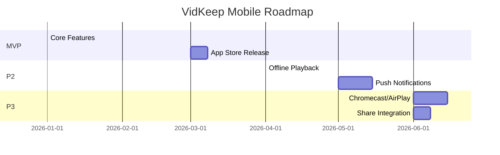

# T027: VidKeep Flutter Mobile App Development

## 1. Overview

**Ticket Type**: Feature Development  
**Priority**: Medium  
**Platforms**: Android + iOS  
**Framework**: Flutter (Dart)  

### Summary

Develop a cross-platform mobile application for VidKeep using Flutter, enabling users to browse their video library, stream content, manage favorites, and optionally download videos for offline viewing. The app will connect to the existing VidKeep backend API.

---

## 2. Current Backend API Compatibility

> [!NOTE]
> The existing backend requires **zero modifications** to support the mobile app. All endpoints are REST-based with JSON responses and fully compatible with Flutter HTTP clients.

> [!IMPORTANT]
> **Architecture Update (T026 + T028)**: The backend now runs as a **monolith** (frontend + API in single container on port 3001) with **embedded workers** (no separate ARQ containers). This simplifies deployment and adds new features like download resume and retry tracking.

### 2.1 API Endpoints Available

| Endpoint | Method | Description | Mobile Use Case |
|----------|--------|-------------|-----------------|
| `POST /api/videos/ingest` | POST | Queue video download | Submit new videos |
| `GET /api/videos` | GET | List videos (with filters) | Home screen feed |
| `GET /api/videos/{id}` | GET | Single video details | Video detail screen |
| `PATCH /api/videos/{id}` | PATCH | Update favorite status | Toggle favorites |
| `DELETE /api/videos/{id}` | DELETE | Delete video | Manage library |
| `POST /api/videos/{id}/cancel` | POST | Cancel download | Cancel in-progress |
| `GET /api/stream/{id}` | GET | Stream video (range support) | Video playback |
| `GET /api/thumbnail/{id}` | GET | Thumbnail image | Grid thumbnails |
| `GET /api/channels` | GET | List channels | Channel filter |
| `GET /api/queue/status` | GET | Queue depth | Download status |
| `GET /health` | GET | Health check | API availability |
| `WS /ws/progress` | WebSocket | Download progress | Real-time updates |

### 2.2 Data Models (from Backend)

```dart
// Dart equivalent of TypeScript types from frontend/src/api/types.ts

enum VideoStatus { 
  queued,       // Waiting in queue
  downloading,  // Currently downloading
  resuming,     // NEW (T028): Resuming from partial file after crash recovery
  complete,     // Download finished
  failed,       // Download failed after max retries
  cancelled     // User cancelled
}

class Video {
  final String videoId;
  final String title;
  final String channelName;
  final String? channelId;
  final int? durationSeconds;
  final String? uploadDate;
  final String? description;
  final bool isFavorite;
  final VideoStatus status;
  final int? fileSizeBytes;
  final DateTime createdAt;
  final String? errorMessage;
  final String youtubeUrl;
  final int? downloadProgress;
  final int retryCount;       // NEW (T028): Number of retry attempts (0-3)
  final int? resumedBytes;    // NEW (T028): Bytes already downloaded when resuming
}

class Channel {
  final String channelName;
  final int videoCount;
}

class QueueStatus {
  final int pending;
  final int processing;
  final int total;
  final int maxWorkers;       // NEW (T028): Maximum concurrent downloads
  final int activeWorkers;    // NEW (T028): Currently active downloads
}
```

### 2.3 Video Streaming Compatibility

The backend streaming endpoint (`/api/stream/{id}`) supports:
- **HTTP Range Requests**: Essential for seeking in video player
- **206 Partial Content**: Standard for mobile video players
- **Content-Type**: `video/mp4` (H.264 + AAC)
- **Accept-Ranges**: `bytes`

This is **fully compatible** with Flutter video players (video_player, chewie, better_player).

### 2.4 WebSocket for Real-Time Progress

```dart
// Connection: ws://<host>/ws/progress
// Keepalive: send "ping", receive "pong"

// Progress message format:
{
  "type": "progress",
  "video_id": "abc123",
  "percent": 42,
  "downloaded_bytes": 1048576,
  "total_bytes": 2097152
}
```

---

## 3. Mobile App Features

### 3.1 Core Features (MVP)

| Feature | Priority | Description |
|---------|----------|-------------|
| **Video Library Browser** | P0 | Grid view of all videos with thumbnails |
| **Video Playback** | P0 | Stream videos from server with controls |
| **Channel Filter** | P0 | Filter videos by channel |
| **Favorites** | P0 | Star/unstar videos, filter favorites |
| **Video Ingest** | P0 | Submit YouTube URL for download |
| **Download Progress** | P0 | Real-time progress via WebSocket |
| **Video Details** | P1 | Full metadata view with description |
| **Delete Video** | P1 | Remove video from library |
| **Cancel Download** | P1 | Cancel pending/downloading videos |

### 3.2 Advanced Features (Post-MVP)

| Feature | Priority | Description |
|---------|----------|-------------|
| **Offline Playback** | P2 | Download videos to device storage |
| **Background Download** | P2 | Continue downloads while app is backgrounded |
| **Push Notifications** | P2 | Notify when server-side download completes |
| **Share Integration** | P2 | Share from YouTube app to VidKeep |
| **Picture-in-Picture** | P2 | PiP support on Android/iOS |
| **Chromecast/AirPlay** | P3 | Cast to TV |
| **Biometric Lock** | P3 | Optional app lock |

---

## 4. Technical Architecture

### 4.1 Recommended Flutter Architecture

```
┌─────────────────────────────────────────────────────────────────────────────┐
│                        VidKeep Mobile App Architecture                       │
├─────────────────────────────────────────────────────────────────────────────┤
│                                                                             │
│  ┌─────────────────────────────────────────────────────────────────────┐   │
│  │                        PRESENTATION LAYER                           │   │
│  │  ┌───────────┐  ┌───────────┐  ┌───────────┐  ┌───────────┐        │   │
│  │  │  Home     │  │  Video    │  │  Player   │  │  Ingest   │        │   │
│  │  │  Screen   │  │  Detail   │  │  Screen   │  │  Screen   │        │   │
│  │  └───────────┘  └───────────┘  └───────────┘  └───────────┘        │   │
│  └─────────────────────────────────────────────────────────────────────┘   │
│                                    │                                        │
│  ┌─────────────────────────────────┴───────────────────────────────────┐   │
│  │                        STATE MANAGEMENT                             │   │
│  │                    (Riverpod / BLoC / Provider)                     │   │
│  │  ┌───────────────┐  ┌───────────────┐  ┌───────────────┐           │   │
│  │  │ VideoProvider │  │ ChannelState  │  │ DownloadState │           │   │
│  │  └───────────────┘  └───────────────┘  └───────────────┘           │   │
│  └─────────────────────────────────────────────────────────────────────┘   │
│                                    │                                        │
│  ┌─────────────────────────────────┴───────────────────────────────────┐   │
│  │                          DATA LAYER                                 │   │
│  │  ┌───────────────┐  ┌───────────────┐  ┌───────────────┐           │   │
│  │  │ API Client    │  │ WebSocket     │  │ Local Storage │           │   │
│  │  │ (Dio/http)    │  │ Client        │  │ (SQLite/Hive) │           │   │
│  │  └───────────────┘  └───────────────┘  └───────────────┘           │   │
│  └─────────────────────────────────────────────────────────────────────┘   │
│                                    │                                        │
│                         ┌──────────┴──────────┐                            │
│                         │   VidKeep Backend   │                            │
│                         │   (FastAPI)         │                            │
│                         └─────────────────────┘                            │
│                                                                             │
└─────────────────────────────────────────────────────────────────────────────┘
```

### 4.2 Recommended State Management

**Primary Recommendation: Riverpod 2.0**

| Option | Pros | Cons |
|--------|------|------|
| **Riverpod** (Recommended) | Compile-time safety, excellent async support, testable | Steeper learning curve |
| BLoC | Clear separation, good for large teams | Verbose, more boilerplate |
| Provider | Simple, well documented | Limited async handling |
| GetX | Easy to use | Less testable, implicit dependencies |

### 4.3 Repository Structure

The Flutter mobile app lives in a `mobile/` folder alongside the existing backend and frontend:

```
ViKeep/
├── api/                    # FastAPI backend (existing)
│   ├── main.py
│   ├── routers/
│   └── services/
│
├── frontend/               # React web app (existing)
│   ├── src/
│   └── package.json
│
├── mobile/                 # 🆕 Flutter mobile app
│   ├── lib/
│   ├── android/
│   ├── ios/
│   ├── test/
│   └── pubspec.yaml
│
├── docs/                   # Documentation (existing)
├── docker-compose.yml      # Backend only (mobile runs locally)
└── README.md
```

### 4.4 Mobile App Project Structure

```
mobile/
├── android/                      # Android native code
├── ios/                          # iOS native code
├── lib/
│   ├── main.dart                 # App entry point
│   ├── app.dart                  # MaterialApp configuration
│   │
│   ├── core/
│   │   ├── config/
│   │   │   └── app_config.dart   # API URL, environment
│   │   ├── constants/
│   │   │   └── api_constants.dart
│   │   ├── theme/
│   │   │   ├── app_theme.dart    # Retro terminal theme
│   │   │   └── colors.dart
│   │   └── utils/
│   │       └── formatters.dart   # Duration, file size formatters
│   │
│   ├── data/
│   │   ├── models/
│   │   │   ├── video.dart        # Video model + JSON serialization
│   │   │   ├── channel.dart
│   │   │   └── queue_status.dart
│   │   ├── repositories/
│   │   │   ├── video_repository.dart
│   │   │   └── channel_repository.dart
│   │   └── datasources/
│   │       ├── api_client.dart   # HTTP client (Dio)
│   │       ├── websocket_client.dart
│   │       └── local_storage.dart
│   │
│   ├── providers/                # Riverpod providers
│   │   ├── video_provider.dart
│   │   ├── channel_provider.dart
│   │   ├── download_progress_provider.dart
│   │   └── theme_provider.dart
│   │
│   ├── screens/
│   │   ├── home/
│   │   │   ├── home_screen.dart
│   │   │   └── widgets/
│   │   │       ├── video_grid.dart
│   │   │       ├── video_card.dart
│   │   │       └── filter_bar.dart
│   │   ├── player/
│   │   │   ├── player_screen.dart
│   │   │   └── widgets/
│   │   │       └── player_controls.dart
│   │   ├── video_detail/
│   │   │   └── video_detail_screen.dart
│   │   └── ingest/
│   │       └── ingest_screen.dart
│   │
│   └── widgets/                  # Shared widgets
│       ├── loading_indicator.dart
│       ├── error_widget.dart
│       └── thumbnail_image.dart
│
├── test/                         # Unit + widget tests
├── integration_test/             # Integration tests
├── pubspec.yaml                  # Dependencies
└── README.md
```

---

## 5. Flutter Package Selection

### 5.1 Core Dependencies

```yaml
# pubspec.yaml
dependencies:
  flutter:
    sdk: flutter

  # State Management
  flutter_riverpod: ^2.4.9
  riverpod_annotation: ^2.3.3

  # Networking
  dio: ^5.4.0                      # HTTP client with interceptors
  web_socket_channel: ^2.4.0       # WebSocket support
  connectivity_plus: ^5.0.2        # Network status

  # Video Player
  video_player: ^2.8.2             # Official Flutter plugin
  chewie: ^1.7.4                   # Better player UI wrapper
  # OR
  better_player: ^0.0.84           # More features, controls

  # Image Caching
  cached_network_image: ^3.3.1     # Thumbnail caching

  # Local Storage (for offline + preferences)
  shared_preferences: ^2.2.2       # Simple key-value
  hive_flutter: ^1.1.0             # Fast NoSQL (optional)
  sqflite: ^2.3.2                  # SQLite for offline (P2)

  # File Download (P2 - Offline)
  flutter_downloader: ^1.11.6      # Background downloads
  path_provider: ^2.1.2            # Get storage directories
  permission_handler: ^11.2.0      # Storage permissions

  # UI Components
  flutter_staggered_grid_view: ^0.7.0  # Video grid layout
  shimmer: ^3.0.0                  # Loading skeletons
  fluttertoast: ^8.2.4             # Toast notifications

  # Navigation
  go_router: ^13.1.0               # Declarative routing

  # Code Generation
  freezed_annotation: ^2.4.1       # Immutable models
  json_annotation: ^4.8.1          # JSON serialization

dev_dependencies:
  flutter_test:
    sdk: flutter
  build_runner: ^2.4.8
  freezed: ^2.4.6
  json_serializable: ^6.7.1
  riverpod_generator: ^2.3.9
  mockito: ^5.4.4
  integration_test:
    sdk: flutter
```

### 5.2 Package Justification

| Package | Purpose | Why This Choice |
|---------|---------|-----------------|
| **dio** | HTTP client | Interceptors, timeout handling, better than http |
| **video_player + chewie** | Video playback | Official support, range request compatible |
| **flutter_riverpod** | State management | Async-first, testable, type-safe |
| **cached_network_image** | Thumbnails | Disk + memory caching, placeholder support |
| **go_router** | Navigation | Deep linking support for future share integration |
| **freezed** | Models | Immutable, copyWith, JSON serialization |

---

## 6. Implementation Details

### 6.1 API Client Implementation

```dart
// lib/data/datasources/api_client.dart
import 'package:dio/dio.dart';
import '../models/video.dart';

class VidKeepApiClient {
  final Dio _dio;
  
  VidKeepApiClient({required String baseUrl})
      : _dio = Dio(BaseOptions(
          baseUrl: baseUrl,
          connectTimeout: const Duration(seconds: 10),
          receiveTimeout: const Duration(seconds: 30),
        )) {
    _dio.interceptors.add(LogInterceptor(
      requestBody: true,
      responseBody: true,
    ));
  }

  // GET /api/videos
  Future<List<Video>> getVideos({
    String? channel,
    bool favoritesOnly = false,
    String? statusFilter,
  }) async {
    final response = await _dio.get('/api/videos', queryParameters: {
      if (channel != null) 'channel': channel,
      if (favoritesOnly) 'favorites_only': 'true',
      if (statusFilter != null) 'status_filter': statusFilter,
    });
    return (response.data['videos'] as List)
        .map((json) => Video.fromJson(json))
        .toList();
  }

  // POST /api/videos/ingest
  Future<String> ingestVideo(String url) async {
    final response = await _dio.post('/api/videos/ingest', data: {'url': url});
    return response.data['video_id'];
  }

  // PATCH /api/videos/{id}
  Future<Video> updateFavorite(String videoId, bool isFavorite) async {
    final response = await _dio.patch(
      '/api/videos/$videoId',
      data: {'is_favorite': isFavorite},
    );
    return Video.fromJson(response.data);
  }

  // DELETE /api/videos/{id}
  Future<void> deleteVideo(String videoId) async {
    await _dio.delete('/api/videos/$videoId');
  }

  // POST /api/videos/{id}/cancel
  Future<void> cancelDownload(String videoId) async {
    await _dio.post('/api/videos/$videoId/cancel');
  }

  // GET /api/queue/status (NEW - T028)
  Future<QueueStatus> getQueueStatus() async {
    final response = await _dio.get('/api/queue/status');
    return QueueStatus.fromJson(response.data);
  }

  // Helper: Get stream URL (not a fetch, just URL construction)
  String getStreamUrl(String videoId) => '${_dio.options.baseUrl}/api/stream/$videoId';
  
  // Helper: Get thumbnail URL
  String getThumbnailUrl(String videoId) => '${_dio.options.baseUrl}/api/thumbnail/$videoId';
}
```

### 6.2 WebSocket Progress Handler

```dart
// lib/data/datasources/websocket_client.dart
import 'dart:async';
import 'dart:convert';
import 'package:web_socket_channel/web_socket_channel.dart';

class DownloadProgress {
  final String videoId;
  final int percent;
  final int? downloadedBytes;
  final int? totalBytes;

  DownloadProgress({
    required this.videoId,
    required this.percent,
    this.downloadedBytes,
    this.totalBytes,
  });
}

class WebSocketClient {
  WebSocketChannel? _channel;
  Timer? _pingTimer;
  final _progressController = StreamController<DownloadProgress>.broadcast();
  
  Stream<DownloadProgress> get progressStream => _progressController.stream;
  
  void connect(String wsUrl) {
    _channel = WebSocketChannel.connect(Uri.parse(wsUrl));
    
    _channel!.stream.listen(
      (message) {
        if (message == 'pong') return;
        
        final data = jsonDecode(message);
        if (data['type'] == 'progress') {
          _progressController.add(DownloadProgress(
            videoId: data['video_id'],
            percent: data['percent'],
            downloadedBytes: data['downloaded_bytes'],
            totalBytes: data['total_bytes'],
          ));
        }
      },
      onError: (error) => _reconnect(wsUrl),
      onDone: () => _reconnect(wsUrl),
    );
    
    // Keepalive ping every 30 seconds
    _pingTimer = Timer.periodic(
      const Duration(seconds: 30),
      (_) => _channel?.sink.add('ping'),
    );
  }
  
  void _reconnect(String wsUrl) {
    _pingTimer?.cancel();
    Future.delayed(const Duration(seconds: 5), () => connect(wsUrl));
  }
  
  void dispose() {
    _pingTimer?.cancel();
    _channel?.sink.close();
    _progressController.close();
  }
}
```

### 6.3 Video Player Screen

```dart
// lib/screens/player/player_screen.dart
import 'package:flutter/material.dart';
import 'package:chewie/chewie.dart';
import 'package:video_player/video_player.dart';

class PlayerScreen extends StatefulWidget {
  final String videoId;
  final String title;
  final String streamUrl;

  const PlayerScreen({
    super.key,
    required this.videoId,
    required this.title,
    required this.streamUrl,
  });

  @override
  State<PlayerScreen> createState() => _PlayerScreenState();
}

class _PlayerScreenState extends State<PlayerScreen> {
  late VideoPlayerController _videoController;
  ChewieController? _chewieController;

  @override
  void initState() {
    super.initState();
    _initializePlayer();
  }

  Future<void> _initializePlayer() async {
    // Network video with range request support
    _videoController = VideoPlayerController.networkUrl(
      Uri.parse(widget.streamUrl),
      httpHeaders: {
        'Accept-Ranges': 'bytes',
      },
    );

    await _videoController.initialize();

    _chewieController = ChewieController(
      videoPlayerController: _videoController,
      autoPlay: true,
      looping: false,
      allowFullScreen: true,
      allowMuting: true,
      showControls: true,
      materialProgressColors: ChewieProgressColors(
        playedColor: const Color(0xFF00FF41),  // Neon green
        handleColor: const Color(0xFF00FF41),
        backgroundColor: Colors.grey,
        bufferedColor: Colors.grey[700]!,
      ),
    );

    setState(() {});
  }

  @override
  void dispose() {
    _videoController.dispose();
    _chewieController?.dispose();
    super.dispose();
  }

  @override
  Widget build(BuildContext context) {
    return Scaffold(
      backgroundColor: Colors.black,
      appBar: AppBar(
        title: Text(widget.title),
        backgroundColor: Colors.transparent,
      ),
      body: Center(
        child: _chewieController != null &&
                _chewieController!.videoPlayerController.value.isInitialized
            ? Chewie(controller: _chewieController!)
            : const CircularProgressIndicator(color: Color(0xFF00FF41)),
      ),
    );
  }
}
```

### 6.4 Theme Implementation (Retro Terminal Style)

```dart
// lib/core/theme/app_theme.dart
import 'package:flutter/material.dart';
import 'package:google_fonts/google_fonts.dart';

class AppTheme {
  // VidKeep Retro Terminal color palette
  static const Color neonGreen = Color(0xFF00FF41);      // Primary accent
  static const Color darkGreen = Color(0xFF003B00);       // Accent dark
  static const Color terminalBg = Color(0xFF050505);      // Pure black background
  static const Color cardBg = Color(0xFF0A0A0A);          // Card background
  static const Color textPrimary = Color(0xFFFFFFFF);     // White text
  static const Color textSecondary = Color(0xFF666666);   // Muted text
  static const Color borderColor = Color(0xFF00FF41);     // Green borders

  static ThemeData get darkTheme => ThemeData(
        useMaterial3: true,
        brightness: Brightness.dark,
        scaffoldBackgroundColor: terminalBg,
        colorScheme: ColorScheme.dark(
          primary: neonGreen,
          secondary: neonGreen,
          surface: cardBg,
          background: terminalBg,
        ),
        // Share Tech Mono font for terminal aesthetic
        textTheme: GoogleFonts.shareRegularTextTheme(
          ThemeData.dark().textTheme,
        ).copyWith(
          headlineLarge: GoogleFonts.shareTechMono(
            color: neonGreen,
            fontSize: 28,
            letterSpacing: 1.0,
          ),
          titleLarge: GoogleFonts.shareTechMono(
            color: textPrimary,
            fontSize: 18,
          ),
          bodyLarge: GoogleFonts.shareTechMono(
            color: textPrimary,
            fontSize: 14,
          ),
          bodySmall: GoogleFonts.shareTechMono(
            color: textSecondary,
            fontSize: 12,
          ),
        ),
        appBarTheme: AppBarTheme(
          backgroundColor: terminalBg,
          elevation: 0,
          titleTextStyle: GoogleFonts.shareTechMono(
            color: neonGreen,
            fontSize: 20,
            letterSpacing: 1.0,
          ),
        ),
        cardTheme: CardTheme(
          color: cardBg,
          elevation: 0,
          shape: RoundedRectangleBorder(
            borderRadius: BorderRadius.zero, // Sharp corners
            side: BorderSide(color: borderColor, width: 1),
          ),
        ),
        elevatedButtonTheme: ElevatedButtonThemeData(
          style: ElevatedButton.styleFrom(
            backgroundColor: Colors.transparent,
            foregroundColor: neonGreen,
            side: BorderSide(color: neonGreen, width: 1),
            shape: RoundedRectangleBorder(
              borderRadius: BorderRadius.zero, // Sharp corners
            ),
          ),
        ),
        inputDecorationTheme: InputDecorationTheme(
          filled: true,
          fillColor: cardBg,
          border: OutlineInputBorder(
            borderRadius: BorderRadius.zero,
            borderSide: BorderSide(color: darkGreen),
          ),
          focusedBorder: OutlineInputBorder(
            borderRadius: BorderRadius.zero,
            borderSide: BorderSide(color: neonGreen),
          ),
          labelStyle: GoogleFonts.shareTechMono(color: textSecondary),
          hintStyle: GoogleFonts.shareTechMono(color: textSecondary),
        ),
        bottomNavigationBarTheme: BottomNavigationBarThemeData(
          backgroundColor: terminalBg,
          selectedItemColor: neonGreen,
          unselectedItemColor: textSecondary,
        ),
      );
}
```

---

## 7. Offline Playback Implementation (P2)

### 7.1 Architecture Overview

```
┌─────────────────────────────────────────────────────────────────┐
│                    OFFLINE PLAYBACK FLOW                        │
├─────────────────────────────────────────────────────────────────┤
│                                                                 │
│   ┌─────────────────┐     ┌─────────────────┐                  │
│   │  Download       │     │  Local SQLite   │                  │
│   │  Manager        │────▶│  (metadata)     │                  │
│   │  (background)   │     └─────────────────┘                  │
│   └────────┬────────┘              │                            │
│            │                       │                            │
│            ▼                       ▼                            │
│   ┌─────────────────┐     ┌─────────────────┐                  │
│   │  Device Storage │     │  Sync Manager   │                  │
│   │  /videos/       │     │  (online/offline│                  │
│   │  {id}.mp4       │     │   detection)    │                  │
│   └─────────────────┘     └─────────────────┘                  │
│                                    │                            │
│                           ┌────────▼────────┐                  │
│                           │  Video Player   │                  │
│                           │  (local or      │                  │
│                           │   network URL)  │                  │
│                           └─────────────────┘                  │
│                                                                 │
└─────────────────────────────────────────────────────────────────┘
```

### 7.2 Key Packages for Offline

| Package | Purpose |
|---------|---------|
| `flutter_downloader` | Background download with progress |
| `path_provider` | Get app documents directory |
| `permission_handler` | Request storage permissions |
| `sqflite` | Store offline video metadata |
| `connectivity_plus` | Detect online/offline state |

### 7.3 Download Manager Implementation

```dart
// lib/data/datasources/download_manager.dart
import 'package:flutter_downloader/flutter_downloader.dart';
import 'package:path_provider/path_provider.dart';

class OfflineDownloadManager {
  static Future<void> initialize() async {
    await FlutterDownloader.initialize(debug: true);
  }

  Future<String> downloadVideo(String videoId, String streamUrl) async {
    final dir = await getApplicationDocumentsDirectory();
    final savePath = '${dir.path}/videos';

    final taskId = await FlutterDownloader.enqueue(
      url: streamUrl,
      savedDir: savePath,
      fileName: '$videoId.mp4',
      showNotification: true,
      openFileFromNotification: false,
    );

    return taskId!;
  }

  Future<String?> getLocalVideoPath(String videoId) async {
    final dir = await getApplicationDocumentsDirectory();
    final filePath = '${dir.path}/videos/$videoId.mp4';
    // Check if file exists
    // Return path if exists, null otherwise
  }

  Future<void> deleteLocalVideo(String videoId) async {
    // Delete file from storage
    // Update SQLite metadata
  }
}
```

---

## 8. Server Connection Configuration

### 8.1 Configuration Options

The app needs to connect to the VidKeep server. Options:

| Approach | Pros | Cons |
|----------|------|------|
| **Manual IP Entry** | Simple, works on LAN | User must know server IP |
| **mDNS/Bonjour Discovery** | Auto-discover on LAN | Requires backend changes |
| **QR Code Setup** | Easy onboarding | Requires web UI to show QR |
| **Saved Server URL** | Convenience | N/A |

**Recommended**: Manual IP entry with URL persistence (SharedPreferences).

```dart
// lib/screens/settings/server_config_screen.dart
class ServerConfigScreen extends StatefulWidget {
  @override
  Widget build(BuildContext context) {
    return Scaffold(
      appBar: AppBar(title: const Text('Server Configuration')),
      body: Padding(
        padding: const EdgeInsets.all(16),
        child: Column(
          children: [
            TextField(
              decoration: const InputDecoration(
                labelText: 'Server URL',
                hintText: 'http://192.168.1.100:3001',
              ),
              onChanged: (value) => // Save to SharedPreferences
            ),
            ElevatedButton(
              onPressed: () => // Test connection with /health endpoint
              child: const Text('Test Connection'),
            ),
          ],
        ),
      ),
    );
  }
}
```

### 8.2 Backend API URL Options

> [!NOTE]
> **Post-T026**: The application is now a monolith serving both frontend and API on a single port.

| Environment | URL Pattern | Notes |
|-------------|-------------|-------|
| Local LAN (Docker) | `http://192.168.x.x:3001` | Default monolith port |
| Tailscale/WireGuard | `http://vidkeep.ts.net:3001` | VPN access |
| Reverse Proxy (HTTPS) | `https://vidkeep.yourdomain.com` | Production recommended |

---

## 9. Platform-Specific Considerations

### 9.1 Android

| Requirement | Implementation |
|-------------|----------------|
| Min SDK | 24 (Android 7.0) |
| Target SDK | 34 (Android 14) |
| Permissions | `INTERNET`, `WRITE_EXTERNAL_STORAGE` (for offline) |
| Background | WorkManager for background downloads |

```xml
<!-- android/app/src/main/AndroidManifest.xml -->
<uses-permission android:name="android.permission.INTERNET" />
<uses-permission android:name="android.permission.WRITE_EXTERNAL_STORAGE" 
    android:maxSdkVersion="28" />
```

### 9.2 iOS

| Requirement | Implementation |
|-------------|----------------|
| Min iOS | 15.0 |
| Permissions | NSAppTransportSecurity for HTTP (dev) |
| Background | Background fetch for download status |

```xml
<!-- ios/Runner/Info.plist -->
<key>NSAppTransportSecurity</key>
<dict>
    <key>NSAllowsArbitraryLoads</key>
    <true/>  <!-- For development; use specific domains in production -->
</dict>
```

---

## 10. Effort Estimation

### 10.1 Development Phases

| Phase | Duration | Description |
|-------|----------|-------------|
| **Setup & Scaffolding** | 1 week | Project setup, architecture, CI/CD |
| **Core Features (MVP)** | 3-4 weeks | Video list, playback, favorites, ingest |
| **Polish & Testing** | 1-2 weeks | UI refinement, accessibility, testing |
| **Offline Mode (P2)** | 2 weeks | Download manager, local storage |
| **App Store Submission** | 1 week | Screenshots, metadata, review |
| **Total MVP** | **6-8 weeks** | |

### 10.2 Detailed Task Breakdown

| Task | Effort | Complexity |
|------|--------|------------|
| Flutter project setup with architecture | 8h | Low |
| API client implementation | 8h | Low |
| Video list + grid UI | 16h | Medium |
| Video player integration | 12h | Medium |
| WebSocket progress | 8h | Medium |
| Channel filter + favorites | 8h | Low |
| Ingest modal/screen | 8h | Low |
| Theme implementation | 6h | Low |
| Server configuration screen | 4h | Low |
| Error handling + loading states | 8h | Medium |
| Unit tests | 12h | Medium |
| Widget tests | 12h | Medium |
| Integration tests | 8h | Medium |
| **MVP Total** | **~120h** | |

---

## 11. Testing Strategy

### 11.1 Unit Tests

```dart
// test/data/repositories/video_repository_test.dart
void main() {
  group('VideoRepository', () {
    late MockApiClient mockApiClient;
    late VideoRepository repository;

    setUp(() {
      mockApiClient = MockApiClient();
      repository = VideoRepository(mockApiClient);
    });

    test('getVideos returns list of videos', () async {
      when(mockApiClient.getVideos()).thenAnswer(
        (_) async => [Video.mock()],
      );

      final videos = await repository.getVideos();

      expect(videos, hasLength(1));
      verify(mockApiClient.getVideos()).called(1);
    });
  });
}
```

### 11.2 Widget Tests

```dart
// test/screens/home/video_card_test.dart
void main() {
  testWidgets('VideoCard displays title and channel', (tester) async {
    final video = Video(
      videoId: 'abc123',
      title: 'Test Video',
      channelName: 'Test Channel',
      // ...
    );

    await tester.pumpWidget(
      MaterialApp(home: VideoCard(video: video)),
    );

    expect(find.text('Test Video'), findsOneWidget);
    expect(find.text('Test Channel'), findsOneWidget);
  });
}
```

### 11.3 Integration Tests

```dart
// integration_test/app_test.dart
void main() {
  IntegrationTestWidgetsFlutterBinding.ensureInitialized();

  testWidgets('Full app flow: browse, play, favorite', (tester) async {
    app.main();
    await tester.pumpAndSettle();

    // Verify video grid loads
    expect(find.byType(VideoGrid), findsOneWidget);

    // Tap first video
    await tester.tap(find.byType(VideoCard).first);
    await tester.pumpAndSettle();

    // Verify player opens
    expect(find.byType(PlayerScreen), findsOneWidget);
  });
}
```

---

## 12. CI/CD Pipeline

### 12.1 GitHub Actions Workflow

```yaml
# .github/workflows/flutter.yml
name: Flutter CI

on:
  push:
    branches: [main]
  pull_request:
    branches: [main]

jobs:
  build:
    runs-on: ubuntu-latest
    steps:
      - uses: actions/checkout@v4
      - uses: subosito/flutter-action@v2
        with:
          flutter-version: '3.16.x'
          channel: 'stable'

      - run: flutter pub get
      - run: flutter analyze
      - run: flutter test
      - run: flutter build apk --release
      - run: flutter build ios --release --no-codesign
```

---

## 13. Security Considerations

| Concern | Mitigation |
|---------|------------|
| API URL exposure | Store in secure storage, not hardcoded |
| Man-in-the-middle | Support HTTPS when available |
| Offline video files | Store in app-private directory |
| Future auth | Plan for token-based auth (JWT) |

---

## 14. Future Enhancements Roadmap



---

## 15. Decision Points

> [!IMPORTANT]
> The following items need to be resolved before or during implementation.

### 15.1 Technical Decisions

| # | Decision | Options | Status |
|---|----------|---------|--------|
| 1 | **State Management** | Riverpod (recommended) / BLoC / Provider | TBD |
| 2 | **Video Player** | chewie (simpler) / better_player (more features) | TBD |
| 3 | **Offline Priority** | MVP / P2 | ✅ **P2** |
| 4 | **App Name** | "VidKeep" / Different mobile branding | TBD |

### 15.2 UX/UI Decisions

| # | Decision | Notes | Status |
|---|----------|-------|--------|
| 5 | **Theme** | Share Tech Mono font, #00ff41 neon green accents | ✅ **Confirmed** |
| 6 | **Navigation Icons** | SVG icons (monochrome) | ✅ **SVG Icons** |
| 7 | **Scrollbars** | Hidden (cleaner) | ✅ **Hidden** |
| 8 | **Pull-to-Refresh** | Include in MVP | ✅ **Yes** |
| 9 | **Authentication** | No auth for now | ✅ **No Auth** |
| 10 | **State Management** | Riverpod 2.0 | ✅ **Confirmed** |
| 11 | **Video Player** | video_player + chewie | ✅ **Confirmed** |
| 12 | **Bundle ID** | `com.vidkeep.mobile` (iOS/Android) | ✅ **Confirmed** |
| 13 | **Server URL Config** | Manual input, saved to SharedPreferences | ✅ **Confirmed** |

### 15.3 Performance Requirements

| # | Decision | Options/Notes | Status |
|---|----------|---------------|--------|
| 12 | **Thumbnail Caching** | Cache size limit? Memory + disk? | TBD |
| 13 | **Video Buffering** | Buffer size, preload next video? | TBD |
| 14 | **Pagination** | Load all videos vs paginate (if 500+ videos) | TBD |
| 15 | **Memory Management** | Video player dispose strategy on navigation | TBD |

### 15.4 Non-Functional Requirements

| # | Decision | Options/Notes | Status |
|---|----------|---------------|--------|
| 16 | **Accessibility** | Screen reader support, font scaling | TBD |
| 17 | **RTL Support** | Arabic/Hebrew support like web app? | TBD |
| 18 | **Analytics/Crash Reporting** | Firebase Crashlytics / Sentry / None | TBD |
| 19 | **App Size Budget** | Target APK/IPA size limit? | TBD |
| 20 | **Battery Optimization** | Background download limits, player optimizations | TBD |
| 21 | **Deep Linking Scheme** | `vidkeep://` for future share integration | TBD |

### 15.5 Network & Error Handling

| # | Decision | Options/Notes | Status |
|---|----------|---------------|--------|
| 22 | **Offline Behavior (MVP)** | Show cached data? Error message? | TBD |
| 23 | **Retry Strategy** | Auto-retry on failure? Max retries? | TBD |
| 24 | **Connection Timeout** | Current: 10s connect, 30s receive | TBD |
| 25 | **WebSocket Reconnect** | Current: 5s delay, infinite retries | TBD |

---

### 15.6 Recommended Documentation Updates

The following sections should be added to this ticket once the above decisions are finalized:

- [ ] **Add UX/UI Section** - Document finalized theme decisions (VT323 font, ASCII icons, hidden scrollbars, glow effects)
- [ ] **Add Performance Section** - Define caching limits, buffering strategy, pagination approach
- [ ] **Add Non-Functional Requirements Section** - Accessibility standards, RTL support, crash reporting choice
- [ ] **Add Empty States & Error Handling Section** - Design patterns for no content, offline mode, API errors
- [ ] **Resolve Remaining Decision Points** - Update TBD items as decisions are made

---

> [!NOTE]
> **Preview Available**: A mobile theme preview is available at `docs/mobile-theme-preview/index.html`
> showing the Retro Terminal design with Share Tech Mono font, #00ff41 neon green accent, CRT scanlines, and SVG navigation icons.

## 16. Execution Logs

| Date | Phase | Action | Details |
|------|-------|--------|---------|
| 2026-01-08 | Setup | Flutter SDK installed | Flutter 3.38.5 via Homebrew |
| 2026-01-08 | Phase 1 | Project created | `flutter create mobile --org com.vidkeep --project-name vidkeep_mobile` |
| 2026-01-08 | Phase 1 | Dependencies configured | 122 packages installed (Riverpod, Dio, chewie, etc.) |
| 2026-01-08 | Phase 1 | Core structure created | `core/`, `data/`, `screens/`, `widgets/` directories |
| 2026-01-08 | Phase 1 | Theme implemented | Retro terminal theme with Share Tech Mono, #00FF41 neon green |
| 2026-01-08 | Phase 1 | Data models created | Video, Channel, QueueStatus with JSON serialization |
| 2026-01-08 | Phase 1 | Build verified | `flutter analyze`: 0 issues, `flutter test`: 1/1 passed |
| 2026-01-09 | Polish | UI updates | Square ADD VIDEO button, blinking cursor in logo |
| 2026-01-09 | Polish | CRT effect | Added scanlines overlay (`scanlines_overlay.dart`) |
| 2026-01-09 | Polish | Nav spacing | Added 4px padding between border and nav icons |
| 2026-01-09 | Phase 1 | **COMPLETE** | Manual testing passed on iOS simulator ✅ |
| 2026-01-09 | Phase 2 | API client | `api_client.dart` - Dio HTTP client with all endpoints |
| 2026-01-09 | Phase 2 | WebSocket | `websocket_client.dart` - Progress stream, auto-reconnect, keepalive |
| 2026-01-09 | Phase 2 | Storage | `local_storage.dart` - SharedPreferences wrapper for server URL |
| 2026-01-09 | Phase 2 | Repositories | `video_repository.dart`, `channel_repository.dart` |
| 2026-01-09 | Phase 2 | Providers | `providers.dart` - Riverpod providers for API, WS, repos |
| 2026-01-09 | Phase 2 | Build verified | `flutter analyze`: 0 issues, `flutter test`: 1/1 passed |

---

## 17. References

- [Flutter Official Docs](https://docs.flutter.dev/)
- [Riverpod Documentation](https://riverpod.dev/)
- [video_player Plugin](https://pub.dev/packages/video_player)
- [chewie Player](https://pub.dev/packages/chewie)
- [flutter_downloader](https://pub.dev/packages/flutter_downloader)
- [VidKeep Backend API](../development/api-docs.md) *(if exists)*

